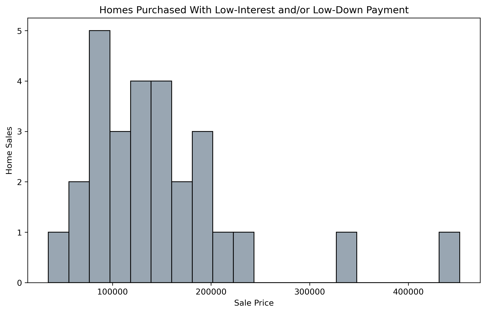
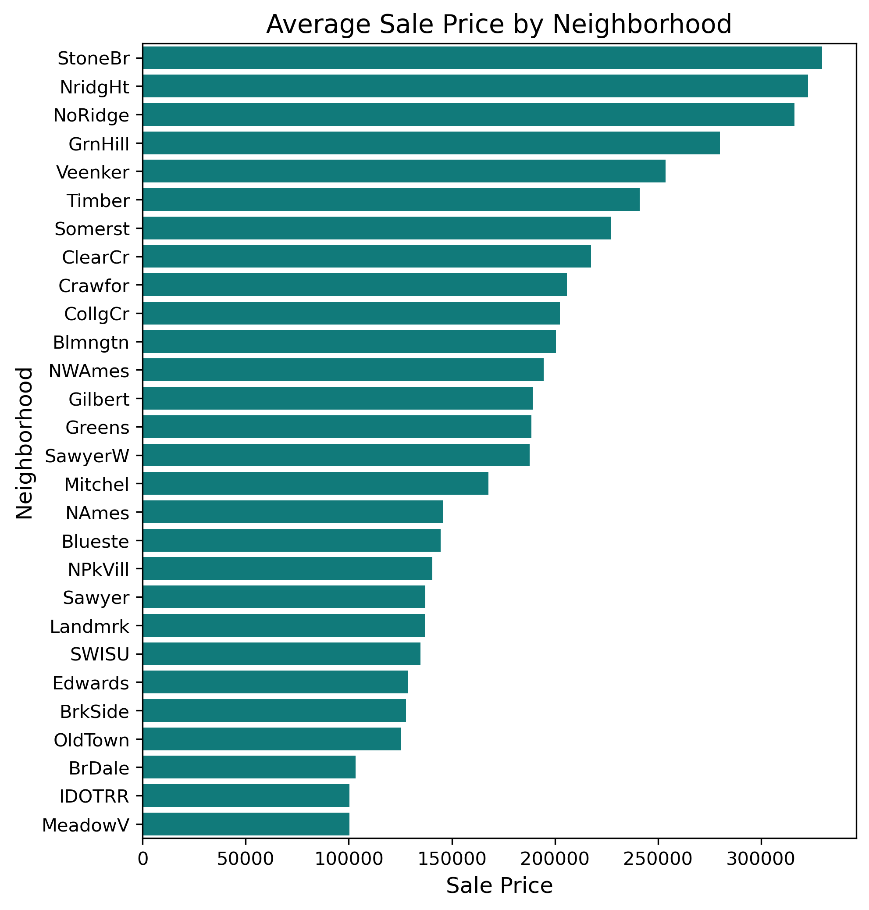
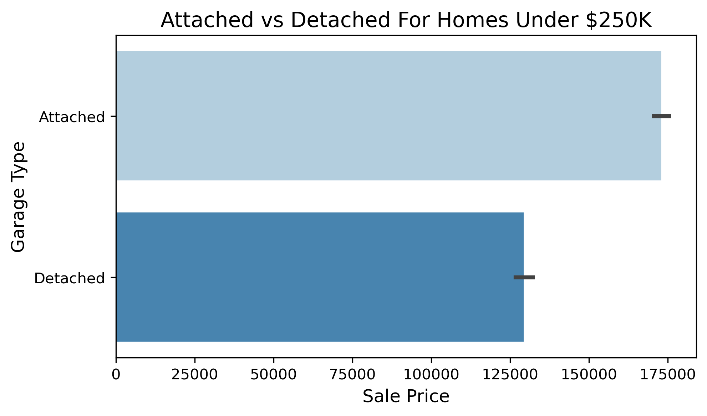
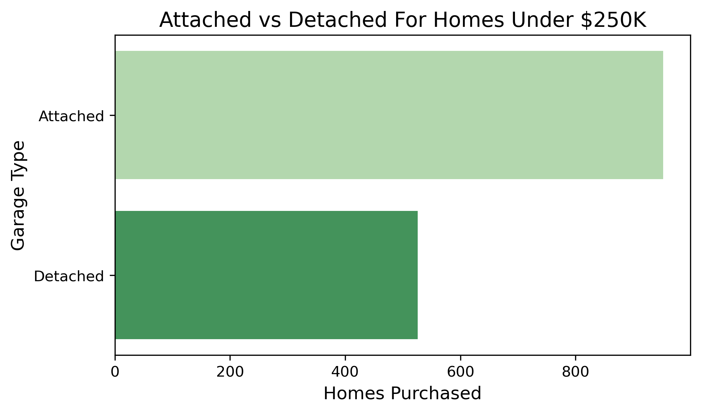

# **Project 2: Ames Housing Data and Kaggle Challenge**
## **DSI 1010 - Debbie Sim**
---

## Repo Folder Organization
|Folder|Type|Description|
|---|---|---|
|cleaned_datasets|folder|contains the cleaned datasets post data cleaning, post pre-processing, & for modeling |
|datasets|folder|contains raw datasets|
|plots|folder|exported graphs from jupyter lab as png files| 
|01_EDA_and_Cleaning|jupyter notebook|contains jupyter lab notebook with data cleaning and EDA|
|02_Pre_Processing_and_Feature-Engineering|jupyter notebook|contains jupyter lab notebook with pre-processing and feature engineering|
|03_Model-Tuning_and_Conclusions|jupyter notebook|contains jupyter lab notebook with model testing & final conclusions|
|04_Data-Visualization|jupyter notebook|contains jupyter lab notebook with EDA part 2 & final plots|
|05_Kaggle_Submission|jupyter notebook|contains jupyter lab notebook with kaggle predictions csv output from repo data|
|05_Kaggle_Submission-Redo|jupyter notebook|DO NOT USE - contains jupyter lab notebook with kaggle predictions csv output from kaggle download |
|DS_kaggle_submission.csv|csv file|contains sale price predictions & id - correct|
|DS_kaggle_submission-Redo.csv|csv file|DO NOT USE - contains sale price predictions & id from kaggle download|
|README-DebbieSim-Project2.md|README|Debbie created README file for project 2|
|GADSI1010_DebbieSim_Project2.pdf|pdf|pdf of presentation slides|
|README.md|README|Original unedited README file for project 2|
|suggestions.md|README|Original unedited README suggestions file for project 2|
|data-dictionary.txt|txt file|txt file of full data dictionary pulled from website|

## Problem Statement

A real estate agent in Ames is working with first-time homebuyers who qualified for the city's Homebuyer Assistance Program (HOME).  The homebuyers are creating a list of house features that are important to them in order to narrow down the list of homes to visit. To make a more informed and realistic list of must-haves and good-to-haves, the family requested information on current trends in home sales. Based on historical home sales in Ames, what are some features that are more likely to increase the cost of a home?

## Background Information
The city of Ames Iowa offers a homebuyer assistance program called Home Investment Partnership Grant (HOME). The program provides approved individuals with incomes at or below 80% the area median income limits financial assistance to purchase homes in Ames. Financial assistance may be given to cover down payment costs, closing costs, and/or PITI principal, interest, tax, insurance) payments. The total amount of assistance cannot exceed 13,500.

Knowing that applicants will have restrictions on home price due to income-level, it will be important for them to know what features are most likely to impact cost and potentially be out of range for them.

**Notable Conditions** ([*source*](https://www.cityofames.org/Home/ShowDocument?id=15833))

- most recently, for a family of 4, gross income cannot exceed 71,950. ([*source*](https://www.cityofames.org/home/showpublisheddocument/65504/637816353835670000)).
- all homebuyers must contribute a minimum of 1,500 or 1.5% of the purchase price of the home, whichever is greater
- Applicants must attend seminars and receive a certification of completion before being eligible for the grant
- Applicant selection is on a first-come, first-serve basis
- Property must be a single-family home, town-home, or modular home

## Data Dictionary ([*source*](https://www.kaggle.com/competitions/dsi-1010-regression-challenge/data))
*Please see source above or data-dictionary.txt file for more details*

### *Dataset: housing_preprocessed1_data.csv*

|Feature|Type|Dataset|Description|
|---|---|---|---|
|id|int|housing_preprocessed1_data|observation number|
|pid|int|housing_preprocessed1_data|parcel identification number - can be used with city web site for parcel review|
|mssubclass|int|housing_preprocessed1_data|Identifies the type of dwelling involved in the sale|
|mszoning|object|housing_preprocessed1_data|Identifies the general zoning classification of the sale|
|lotfrontage|float|housing_preprocessed1_data|Linear feet of street connected to property|
|lotarea|int|housing_preprocessed1_data|Lot size in square feet| 
|street|object|housing_preprocessed1_data|Type of road access to property|
|lotshape|object|housing_preprocessed1_data|General shape of property|
|landcontour|object|housing_preprocessed1_data|Flatness of the property|
|utilities|object|housing_preprocessed1_data|Type of utilities available|
|lotconfig|object|housing_preprocessed1_data|Lot configuration|
|landslope|object|housing_preprocessed1_data|Slope of property|
|neighborhood|object|housing_preprocessed1_data|Physical locations within Ames city limits|
|condition1|object|housing_preprocessed1_data|Proximity to various conditions|
|condition2|object|housing_preprocessed1_data|Proximity to various conditions -if more than one is present|
|bldgtype|object|housing_preprocessed1_data|Type of dwelling|
|housestyle|object|housing_preprocessed1_data|Style of dwelling|
|overallqual|int|housing_preprocessed1_data|Rates the overall material and finish of the house|
|overallcond|int|housing_preprocessed1_data|Rates the overall condition of the house| 
|yearbuilt|int|housing_preprocessed1_data|Original construction date|
|yearremod_add|int|housing_preprocessed1_data|Remodel date-same as construction date if no remodeling or additions|
|roofstyle|object|housing_preprocessed1_data|Type of roof|
|roofmatl|object|housing_preprocessed1_data|Roof material|
|exterior1st|object|housing_preprocessed1_data|Exterior covering on house|
|exterior2nd|object|housing_preprocessed1_data|Exterior covering on house-if more than one material|
|masvnrtype|object|housing_preprocessed1_data|Masonry veneer type| 
|masvnrarea|float|housing_preprocessed1_data|Masonry veneer area in square feet|
|exterqual|object|housing_preprocessed1_data|Evaluates the quality of the material on the exterior|
|extercond|object|housing_preprocessed1_data|Evaluates the present condition of the material on the exterior|
|foundation|object|housing_preprocessed1_data|Type of foundation|
|bsmtqual|object|housing_preprocessed1_data|Evaluates the height of the basement|
|bsmtcond|object|housing_preprocessed1_data|Evaluates the general condition of the basement|
|bsmtexposure|object|housing_preprocessed1_data|Refers to walkout or garden level walls|
|bsmtfintype1|object|housing_preprocessed1_data|Rating of basement finished area|
|bsmtfinsf1|float|housing_preprocessed1_data|Type 1 finished square feet|
|bsmtfintype2|object|housing_preprocessed1_data|Rating of basement finished area-if multiple types|
|bsmtfinsf2|float|housing_preprocessed1_data|Type 2 finished square feet|
|bsmtunfsf|float|housing_preprocessed1_data|Unfinished square feet of basement area|
|totalbsmtsf|float|housing_preprocessed1_data|Total square feet of basement area|
|heating|object|housing_preprocessed1_data|Type of heating|
|heatingqc|object|housing_preprocessed1_data|Heating quality and condition|
|centralair|object|housing_preprocessed1_data|Central air conditioning|
|electrical|object|housing_preprocessed1_data|Electrical system| 
|1stflrsf|int|housing_preprocessed1_data|First Floor square feet|
|2ndflrsf |int|housing_preprocessed1_data|Second floor square feet|
|lowqualfinsf|int|housing_preprocessed1_data|Low quality finished square feet-all floors|
|grlivarea|int|housing_preprocessed1_data|Above grade (ground) living area square feet|
|bsmtfullbath|float|housing_preprocessed1_data|Basement full bathrooms|
|bsmthalfbath |float|housing_preprocessed1_data|Basement half bathrooms|
|fullbath|int|housing_preprocessed1_data|Full bathrooms above grade|
|halfbath|int|housing_preprocessed1_data|Half baths above grade|
|bedroomabvgr|int|housing_preprocessed1_data|Total rooms above ground|
|kitchenabvgr|int|housing_preprocessed1_data|Kitchens above grade|
|kitchenqual|object|housing_preprocessed1_data|Kitchen quality|
|totrmsabvgrd|int|housing_preprocessed1_data|Total rooms above grade (does not include bathrooms)|
|functional|object|housing_preprocessed1_data|Home functionality|
|fireplaces |int|housing_preprocessed1_data|Number of fireplaces|
|garagetype |object|housing_preprocessed1_data|Garage location|
|garageyrblt|float|housing_preprocessed1_data|Year garage was built|
|garagefinish|object|housing_preprocessed1_data|Interior finish of the garage|
|garagecars|float|housing_preprocessed1_data|Size of garage in car capacity|
|garagearea |float|housing_preprocessed1_data|Size of garage in square feet|
|garagequal|object|housing_preprocessed1_data|Garage quality|
|garagecond|object|housing_preprocessed1_data|Garage condition|
|paveddrive|object|housing_preprocessed1_data|Paved driveway|
|wooddecksf|int|housing_preprocessed1_data|Wood deck area in square feet|
|openporchsf|int|housing_preprocessed1_data|Open porch area in square feet|
|enclosedporch|int|housing_preprocessed1_data|Enclosed porch area in square feet|
|3ssnporch|int|housing_preprocessed1_data|Three season porch area in square feet|
|screenporch|int|housing_preprocessed1_data|Screen porch area in square feet|
|poolarea|int|housing_preprocessed1_data|Pool area in square feet|
|miscfeature|object|housing_preprocessed1_data|Miscellaneous feature not covered in other categories|
|miscval|int|housing_preprocessed1_data|Value of miscellaneous feature|
|mosold|int|housing_preprocessed1_data|Month Sold|
|yrsold|int|housing_preprocessed1_data|Year Sold|
|saletype|object|housing_preprocessed1_data|Type of sale|
|saleprice|int|housing_preprocessed1_data|Sale price in USD|
|has_garage|int|housing_preprocessed1_data|1-has garage, 0- does not have garage|
|has_pool| int|housing_preprocessed1_data|1-has poole, 0- does not have pool|
|has_basement| int|housing_preprocessed1_data|1-has basement, 0- does not have basement|
|has_fence|int|housing_preprocessed1_data|1-has fence, 0- does not have fence|
|has_alley|int|housing_preprocessed1_data|1-has alley, 0- does not have alley|

## Summary of Analysis

* #### Historically, homes purchased in Ames, identified as a low-interest, low-down, or low-interest & low-down sale type, had a sale price equal to or less than 250,000.
    * Because I am unable to exactly identify buyers participating in the homebuyer assistance program, I used the saletype feature in the dataset to get a feel for what home prices might be for folks purchasing with low-interest and/or low-down contracts.
    * Other than the 2 outliers, the plot shows that the sale price for these specific homes are 250K or less.

* #### Homes in Stone Brook, Northridge Heights, & Northridge see the highest average home sale prices & are strongest neighborhood predictors of sale price.
    * Homes purchased in these three neighborhoods are more expensive than other neighborhoods - Stone Brook, Northridge Heights, Northridge.
    * This was evident in my model as well. Whether or not the home is in Stone Brook, Northridge Heights, and Northridge were in the top 15 of the features (73 total) that were the highest predictors of sale price.

* #### 75% of all building types were purchased for ~250K or less.
    * This visualization shows the range of sale prices by building type.
    * You can see that 75% of all building types were purchased for 250K or less.
    * The middle 50% of single fam homes and end unit townhomes is higher than the other building types. I was expecting that for single family homes, but didn't realize that whether or not a townhouse was an inner or end unit mattered.

* #### For 250K or less, homes with an attached garage have a higher sale price & almost double the availability than homes with detached garages.
    * Even though homes with an attached garage under 250K are more expensive than homes with a detached garage, there is more availability of homes with an attached garage.
    * This is where a homebuyer can really weigh what’s the deciding factor, price or whether or not there’s an attached garage.

  

**Potential Next Steps**
- look into other features such as kitchen quality and backyard size
- refine my model by being more selective of features before running it through VIF & feature selection via correlations
- utilize polynomial features to feature engineer new variables

## Conclusions & Recommendations

1. Neighborhood selection is important in guaranteeing a home price in range. As expected it's evident that there are neighborhoods where home prices are much more expensive than others. Homebuyers should try to look in neighborhoods other than Stone Brook, Northridge Heights, and Northridge.
2. An attached garage is a feature that will increase the cost of sale price, but can be included in the list of must-haves because it’s more common for a home to have an attached garage than not.
3. You don’t need to be selective about house type because there are homes within a reasonable price range for all types.